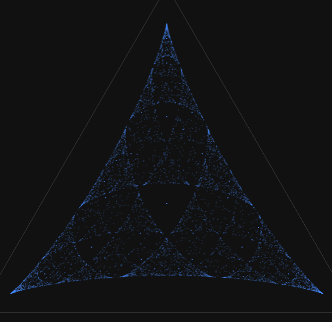

[Try it out!](https://lumi-a.github.io/ghmm)

Interactive visualizer for predictions in [Hidden Markov Models](https://en.wikipedia.org/wiki/Hidden_Markov_model).
Given a generative process defined by observable operator matrices `T[observation, prev_state, next_state]`, we sample trajectories (with initial distribution `initial`). From the emitted observation of a trajectory:
- For each state $S$ we compute the probability "Given the observations, how likely is it that I am currently in state $S$?", and
- For each observation $\omega$ we compute "Given the observations so far, what is the probability that the next observation will be $\omega$?".

These are then plotted in $\mathbb{R}$^States (left) and $\mathbb{R}$^Observations (right). Point brightness encodes how often that point was visited.

## Mess3 as an example process

Consider the Mess3 process:

In state $S_0$, we have a 15% chance of transitioning to state $S_1$, a 10% chance of transitioning to state $S_2$, and a 80% chance of staying in $S_0$. However, we do not observe the states directly, but only the observations $o_1, o_2, o_3$ that are emitted on every state-transition. In this process, the observation only depends on the target-state state $S_i$: The model emits the observation $o_i$ with probability 60%, and emits the other two observations with probability 20% each.

We write these probabilities as a tensor: Given we are currently in state `state`, the probability of transitioning to `next_state` while emitting observation `obs` is `T[obs, state, next_state]`:

```js
T = [[[0.48, 0.02, 0.02],  // Transition-matrix T[state, next_state]
      [0.06, 0.16, 0.02],  // for observation o_0
      [0.06, 0.02, 0.16]],
    
      [[0.16, 0.06, 0.02], // Transition-matrix T[state, next_state]
      [0.02,  0.48, 0.02], // for observation o_1
      [0.02,  0.06, 0.16]],
    
      [[0.16, 0.02, 0.06], // Transition-matrix T[state, next_state]
      [0.02,  0.16, 0.06], // for observation o_2
      [0.02,  0.02, 0.48]]]
```

For example, when we are in state $S_0$ and want to know what the probability of transitioning to $S_1$ (which, on its own, has probability 10%) is while falsely emitting $o_2$ (this false emission has a probability of happening 20% of the time, so 10%*20% = 0.02), we look at the third matrix (responsible for $o_2$-emissions), the first row (current state $S_0$) and second column (target state $S_1$).

When the initial distribution is set to uniform (i.e. the states $S_0, S_1, S_2$ are all equally likely), we obtain this plot.



If the matrices do not sum to [row-stochastic-matrices](https://en.wikipedia.org/wiki/Stochastic_matrix), the code still functions (mostly) fine, as prediction is (mostly) just matrix multiplication. This is a _Generalised_ Hidden Markov Model. The status badge at the bottom right shows you how ill-posed your `T` is.


## Purpose

Visualising these processes was part of the [Iliad](https://iliad.ac) Intensive, and I decided to expand on it, add interactive sliders and a code editor, put it in a browser, and make it 3d.

These visualisations can actually be found within the residual stream of transformers trained on the Mess3 process, which sheds some light on how transformers learn. See [this post](https://www.lesswrong.com/posts/gTZ2SxesbHckJ3CkF/transformers-represent-belief-state-geometry-in-their) for an excellent introduction that goes into far more detail than this readme, or the associated paper: [_Adam S. Shai, Sarah E. Marzen, Lucas Teixeira, Alexander Gietelink Oldenziel, & Paul M. Riechers. (2025). Transformers represent belief state geometry in their residual stream_](https://arxiv.org/abs/2405.15943).
